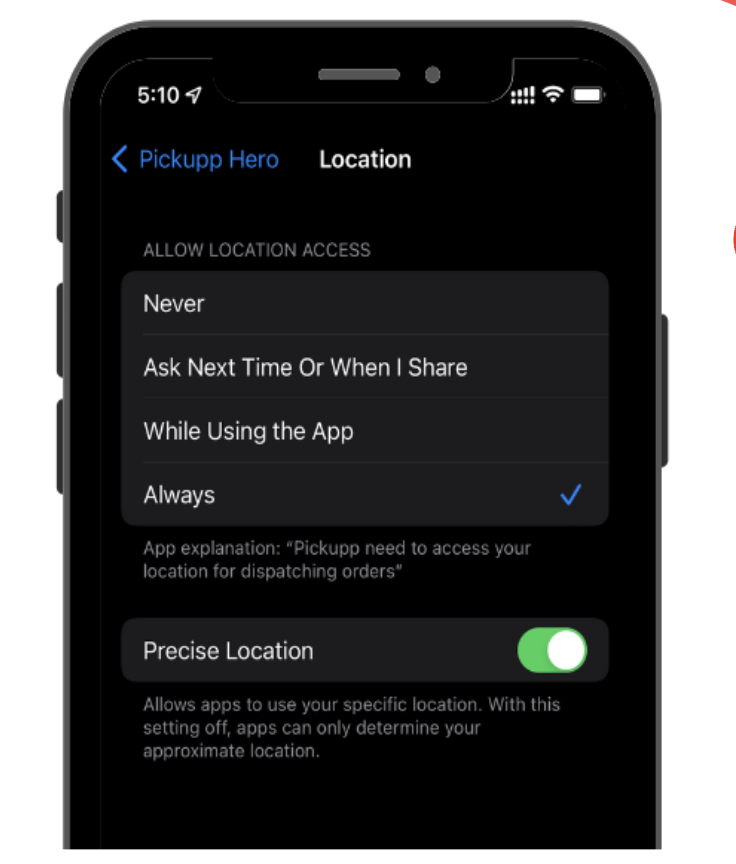

# Viewing & Accepting Orders

## Collecting a Parcel

From a Delivery Agent's perspective:

1. Make sure your mobile device's GPS function is switched ON.\

<figure><figcaption></figcaption></figure>

2. You can scan the QR code or barcode on the parcel with your app to confirm you are picking up the correct parcel.\

<figure><figcaption></figcaption></figure>

3. After you have collected the parcel:
   * Make sure your GPS function is still ON.
   * Contact the recipient (via phone call or WhatsApp) to let them know the delivery is on the way.

## Troubleshooting

If you are unable to scan the QR code on the parcel, it may be because the code is damaged or the lighting is poor. Try again in better light or manually enter the first four digits of the order number in the app.

What if the QR code cannot be scanned?

* Go into 'My Orders' on the app.
* Select the order that matches the unscannable parcel.
* Input the first four digits of the order number.\
  \
  
