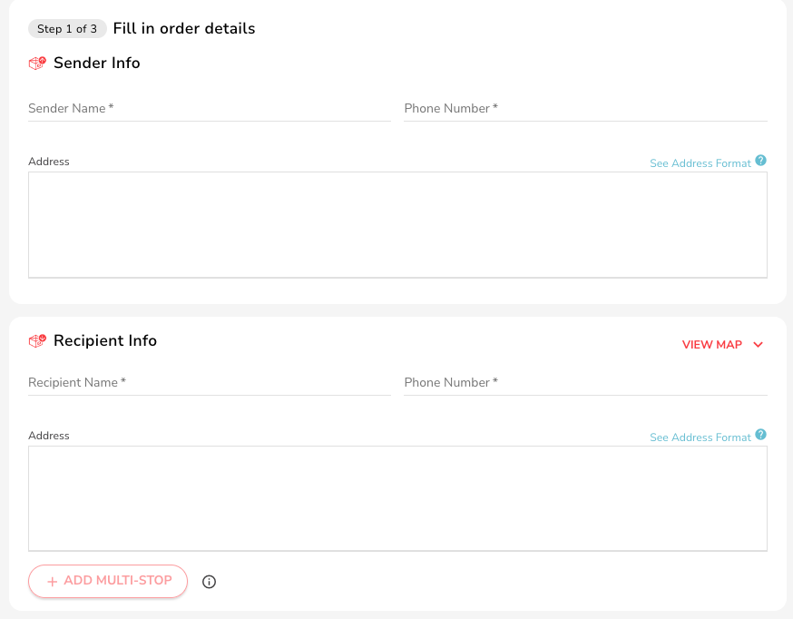
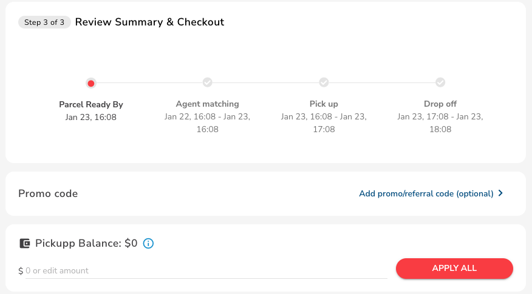
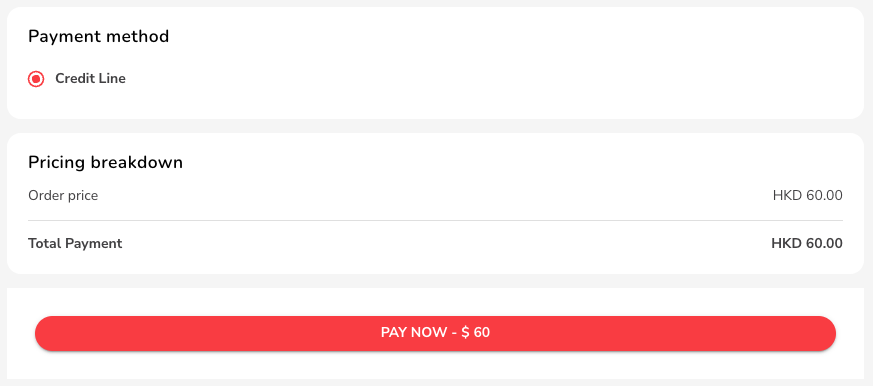

# Create & Schedule a Delivery+ Order

Fill In Order Details

1. After logging in, select "Orders" from the list on the left of the dashboard, then choose"Create Express Order" on the left.

<figure><figcaption>
Choose Express Delivery on the Left
</figcaption></figure>

To create an order under the Delivery+ service offering, follow these steps:

2. If the task requires traveling, provide the pick-up and drop-off addresses, along with the contact information, just like you would for a regular Express order with Sender and Recipient information.
3. Enter "Sender Info" Enter "Pickup Address," "Sender Phone Number" and "Sender Name."
4. Enter "Recipient Info" Enter "Dropoff Address," "Recipient Phone," and "Recipient Name."

<figure><figcaption></figcaption></figure>

4. However, if the task does not require travel, enter both the pick-up and drop-off locations as the <mark style="color:red;">SAME</mark> location where you want the action to be performed (see example below).

<figure><figcaption>
If the task does not require travel, input same pick up and drop off address where the task should be completed
</figcaption></figure>

5. Next enter "Item Info" in the item section, make sure to include a detailed description of any materials or equipment that the freelancer will need to carry or handle.&#x20;
6. Follow the guide below on how to input weight and dimensions:

<figure><figcaption>
If you require a small ladder to be carried to a location to perform a task, indicate "ladder" under Item Info and indicate the weight (here, is approx 1kg)
</figcaption></figure>

4. If you require the agent or freelancer to carry equipment or materials to perform the task, then input the weight and dimension here accordingly.&#x20;

_Example:  If you require the agent to help you pick up a box of camera gears from pick up location to drop off location, and the total weight of camera gears are about 5kg, and the total dimension is 40+40+40cm, then input accordingly under "Manual Input" as such:_

<figure><figcaption></figcaption></figure>

## Filling Out Drop Off Notes and Additional Details

<figure><figcaption>
Use the Notes section to describe what you require the agent to perform
</figcaption></figure>

1. Use the drop-off notes to list any special requests or specific instructions as a to-do list. It's important to be as specific and descriptive as possible to ensure that your requirements are understood by the freelancer.
2. When it comes to providing instructions in this drop-off notes section, here are some important points to consider and tips:

* Be specific and use concise wording. Clearly communicate your requirements or any additional information related to the task. This helps ensure that the instructions are understood accurately.
* Use language that is easy to understand, as if you were explaining the task to a young student. This clarity helps avoid any confusion or misunderstandings.
* If you need the agent to call you for any reason, you can mention it in the drop-off notes section. This allows for direct communication and coordination.
* While there is no limit to the instructions you can provide, it is essential to ensure that they are legal and within the guidelines of the platform.
* You may gain more inspiration by reading our [Delivery+ Tools for You](../delivery+-tools-for-you.md) page

_Note: Complex instructions may make it more challenging to find an agent willing to complete a complex task._

* We strongly recommend providing an estimated time span for task completion or arrival at the location. This helps the agent assess whether the payout is fair. For example, if you require the agent to wait in line for you, specify the number of hours you expect them to wait. Later, when considering the acceptance tip, you can adjust the compensation to account for the hourly rate in addition to the distance-based pricing and travel time.

Remember, clear and concise instructions in the drop-off notes section help ensure a smooth and successful task completion.&#x20;

_Below is an example of writing a clear and concise drop off notes to-do list if you want to find an agent to help you deliver 10 lunch boxes and set the table for a catering job:_

<figure><figcaption></figcaption></figure>

3. Please note: the current pricing has only factored in the distance and delivery, and has not factored in the time required to finish the task. We will discuss how to "[`add acceptance fee`](create-and-schedule-a-delivery+-order.md#create-a-fair-offered-price)" in the below section to further illustrate a fair and reasonable offer to facilitate an agent's acceptance.

## Schedule your Delivery+ Order

1. Choose "Estimated Pickup Time when you need the freelancer to show up".
   * 'Now' - The order will immediately enter the matching process after placing the order.
   * 'Later' - The order will be matched according to your pickup time."
2. Not mandatory, can fill in "Optional Details".&#x20;
   * 'Remarks' - Enter information you want to communicate to the delivery partner.
   * 'Client Reference Number' - Input your company's internal order number for this item for future tracking.
   * 'Cash on Delivery Amount' - To cater to cases whereby the delivery partner will ned to collect the amount you input from the recipient upon delivery.
   * 'Extra Notification Contacts' - You can add up to two additional contacts.
3. All Delivery+ orders will be shown as typical 4 Hour Express. E.g. If you place an order to be ready at 10:00am, it will be a task that will complete by 02:00pm (in 4 hours).
4. ⚠️ Please make sure you choose the right service offering here:

<figure><figcaption></figcaption></figure>

5. Confirm the Entered Data.

* Confirm if information such as "Sender/Recipient/Package Size" is entered correctly. If the order is confirmed without errors, proceed to the order overview & checkout page.

6. Order Overview & Checkout.

* This page provides an overview of your order; please double-check information such as "Sender/Recipient/Package Size" before proceeding.

<figure><figcaption></figcaption></figure>

7.  Payment.

    * After confirming the amount, set up credit card payment.
    * If you have a discount code, enter it in "Use Discount Code" to redeem.

8. After entering payment details, click "PAY NOW".

<figure><figcaption></figcaption></figure>

9.  Order Confirmation.

    * ✨ Delivery+ Order created!
    * After completing this page, proceed to the next step.

<figure><figcaption></figcaption></figure>

10. Prepare what the Agent needs to Take (If Any) and Track Progress

* If you require the agent to send any item to drop off point, prepare the package and mark the order number given by the system on your package. Otherwise, if there is nothing to carry to the drop off point, you can ignore this step.
* Refer to the [Track Orders](track-orders.md) to find the order number.

##

