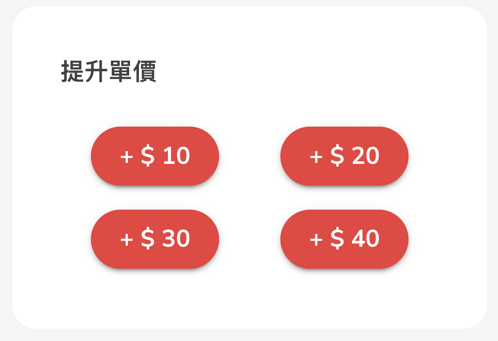

# 添加小費以加快配對自由工

通過添加小費促進訂單配對

如果訂單無法配對，您可以使用我們的「添加小費」功能，加快配對自由工。

<figure><figcaption></figcaption></figure>

* 您可以在「所有訂單」中找到此功能。點擊您想加快配對的訂單（檢視功能應顯示在右側）。&#x20;
* 此功能允許用戶選擇給自由工添加小費，增加他們接受訂單的可能性。&#x20;
* 用戶可以從以下小費金額中選擇：HK$10、HK$20、HK$30或HK$40。
* 給予自由工應有的鼓勵和支持，享受更快速和更個性化的服務。

## 如訂單無法配對，該如何處理

如果訂單於系統嘗試配對超過90分鐘沒有任何人接受，以下是您需要知道的事項：&#x20;

1. 如這段時間內沒有人接受您的訂單，系統將自動取消它。此取消將在您提供的「送達時間」之後60分鐘內發生。&#x20;
2. 請放心，在這種情況下，系統會自動向您發出全額退款。您將通過與下單時使用的相同付款方式收到退款。&#x20;
3. 如果您想增加訂單被配對的機會，您可以通過「[添加小費](tian-jia-xiao-fei-yi-jia-su-su-di-zhuan-yuan-pi-pei.md)」部分增加報酬金。在我們的商家門戶中，您可以逐步調整不同的報酬金額。您可以參考上面的屏幕截圖以了解詳細的操作指南。&#x20;
4. 請注意，Pickupp無法保證在此服務中的每個訂單都能配對成功。儘管我們努力履行所有訂單，但可能存在無合適的代理人接受您的特定任務（基於所需的複雜性、技能和知識不一）。&#x20;

我們理解及時高效服務的重要性，並持續努力改進訂單配對流程，以確保為客戶提供無縫的體驗。
