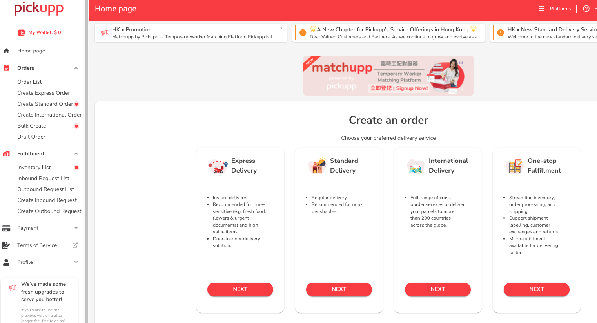
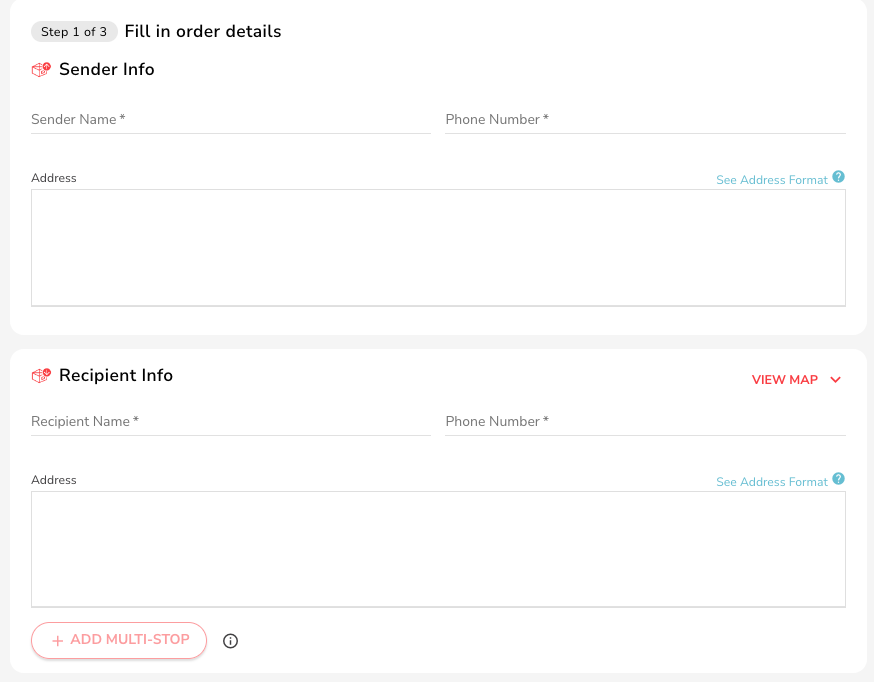
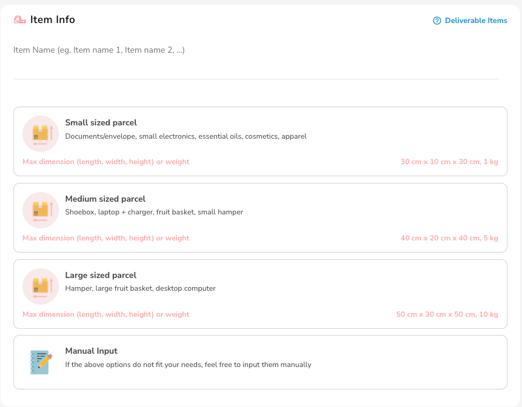
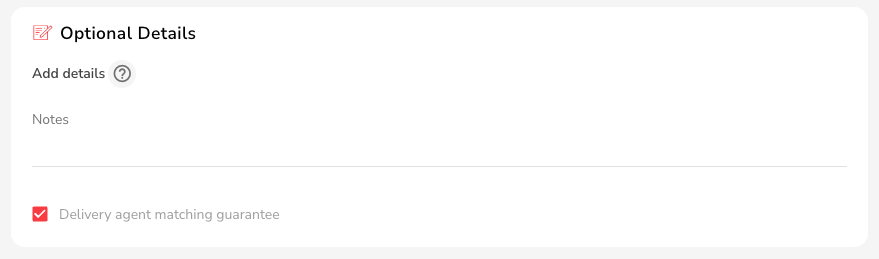
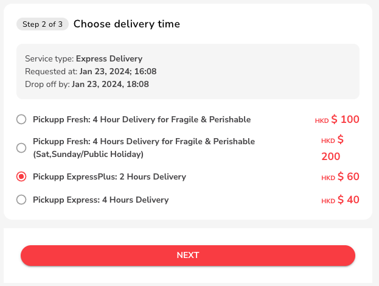
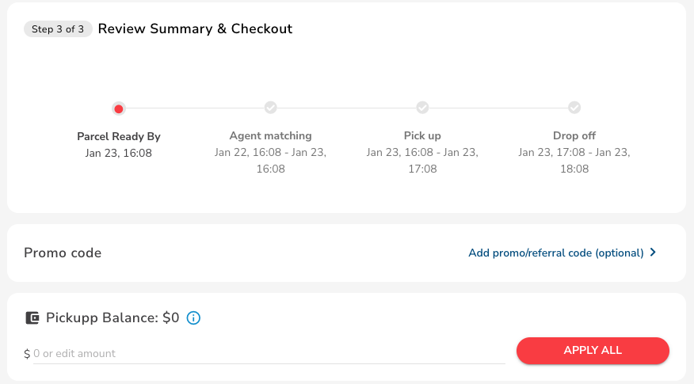
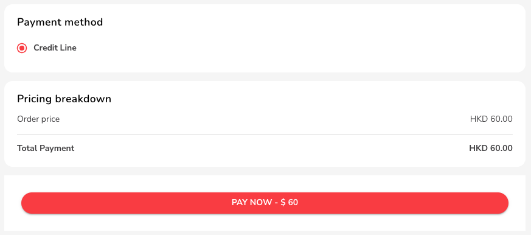
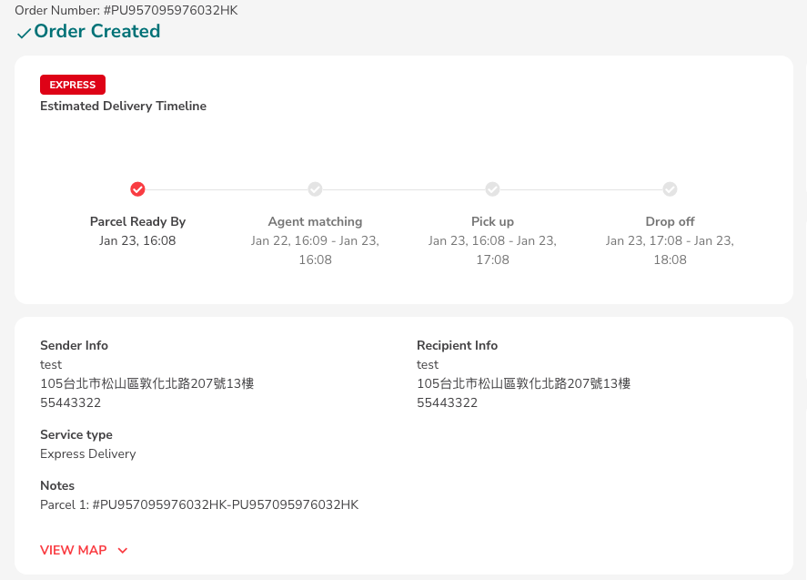

# Create & Schedule an Express/Express Plus Order

## Fill In Order Details

1. After logging in, select "Orders" from the list on the left of the dashboard, then choose"Create Express Order" on the left.

<figure><figcaption></figcaption></figure>

2. Enter "Sender Info" Enter "Pickup Address," "Sender Phone Number" and "Sender Name."
3. Enter "Recipient Info" Enter "Dropoff Address," "Recipient Phone," and "Recipient Name."

<figure><figcaption></figcaption></figure>

4. Enter "Item Info".
   * Enter package item name/size Maximum size (cm).

| Parcel Type         | Maximum Size (cm)  | Maximum Weight (kg) |
| ------------------- | ------------------ | ------------------- |
| Small sized parcel  |  30\*10\*10        | 1                   |
| Medium sized parcel |  40\*20\*40        | 5                   |
| Large sized parcel  | 50\*30\*50         | 10                  |

<figure><figcaption></figcaption></figure>

5. Manual Input If none of the above options meet your requirements, click "Manual Input" and choose package size and weight manually.

## Schedule an Order

To schedule an order, make sure you are toggled to "Expert Mode", which can be controlled from the left bottom of the menu tray:

<figure><figcaption></figcaption></figure>

1.  Choose "Estimated Pickup Time for the Package".

    * 'Now' - The order will immediately enter the matching process after placing the order.
    * 'Later' - The order will be matched according to your pickup time."

<figure><figcaption></figcaption></figure>

2. Not mandatory, can fill in "Optional Details".&#x20;

* 'Remarks' - Enter information you want to communicate to the delivery partner..
* 'Client Reference Number' - Input your company's internal order number for this item for future tracking.
* 'Cash on Delivery Amount' - The delivery partner will collect the amount you input from the recipient upon delivery.
* 'Extra Notification Contacts' - You can add two additional contacts.
* Clicking on 'Delivery agent matching guarantee' if need to match a delivery agent faster.
  * More information in FAQ-Delivery agent matching guarantee.

<figure><figcaption></figcaption></figure>

3. Choose Order Type.
4. Select "Pickupp Express: 4 Hours Delivery or Pickupp ExpressPlus: 2 Hours Delivery as the order type.
   * ⚠️ Please make sure the time slot meets your requirements.

<figure><figcaption></figcaption></figure>

5. Confirm the Entered Data.
   * Confirm if information such as "Sender/Recipient/Package Size" is entered correctly. If the order is confirmed without errors, proceed to the order overview & checkout page.
6. Order Overview & Checkout.
   * This page provides an overview of your order; please double-check information such as "Sender/Recipient/Package Size" before proceeding.

<figure><figcaption></figcaption></figure>

7. Payment.
   * After confirming the amount, set up credit card payment.
   * If you have a discount code, enter it in "Use Discount Code" to redeem.
   * If billing the company, don't forget to input the tax ID!
8. After entering payment details, click "PAY NOW".

<figure><figcaption></figcaption></figure>

9. Order Confirmation.
   * ✨ Order created!
   * After completing this page, proceed to the next step, which is packaging details.

<figure><figcaption></figcaption></figure>

10. Package Details.
    * Prepare the package and mark the order number given by the system on your package.
    * Refer to the [Track Orders](order-tracking-guide.md) to find the order number.

## Unable to Match with Delivery Agent&#x20;

1. Exceeding the expected delivery time without agent matching.
   * The system will automatically cancel the order and refund the amount to your account.
2. Overweight or oversized packages.
   * If the delivery partner has accepted the order, and upon reaching the delivery location, the measurements or weight exceed the agreed limits, the delivery partner may refuse to accept the order.

## Delivery Agent Matching Guarantee

1. Raise your order matching rate
2. Click on 'Delivery agent matching guarantee' when placing order will automatically raise the price, increasing the chances of matching with a delivery partner.
   * If you choose to increase the unit price for the first login, a partner matching declaration will appear.
   * Confirm and click next.

