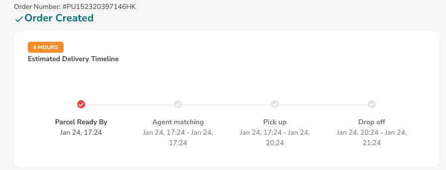
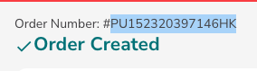
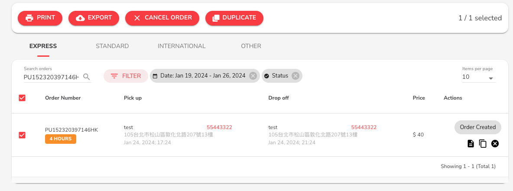

# Track Orders

1. View "Order Number" on the order completion page.

<figure><figcaption></figcaption></figure>

<figure><figcaption></figcaption></figure>

2. Copy the number above "Create Order" on the order completion page.
3. View "Order Number"
4. Click on the left-side list "View All Orders" to see all order statuses. Then click "Express Orders" to see established Express orders.

<figure><figcaption></figcaption></figure>

5. Created orders will have the "Order Number" for each item, fill this order number in the package you want to deliver.
