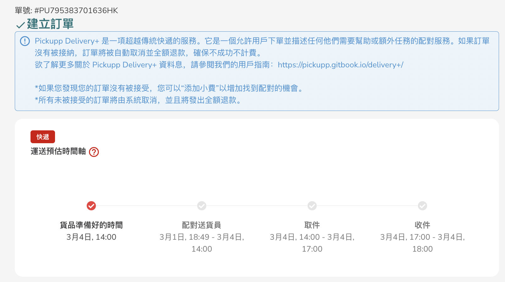

# 追蹤訂單

在訂單完成頁面查看「單號」

<figure><figcaption></figcaption></figure>

在建立訂單上方，複製上面「創建訂單」旁邊的編號（PUXXXXXXXXXXXXHK）。&#x20;

<figure><figcaption></figcaption></figure>

2. 於主頁查看「單號」： 點擊左側的列表「查看所有訂單」以查看所有訂單狀態
3. 然後點擊「速遞訂單」以查看已建立的Express / ExpressPlus訂單

<figure><figcaption></figcaption></figure>

4. 建立訂單每個項目都會有一個「單號」，請將這個單號寫在您要交付的包裹上。
