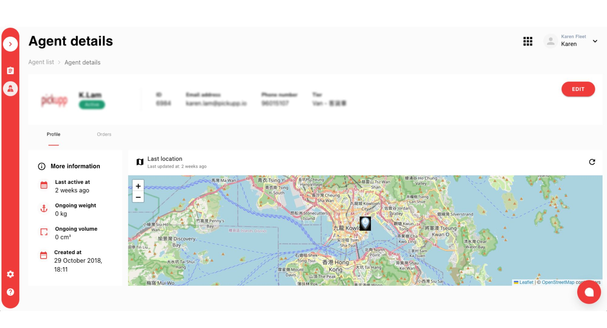

# Managing & Editing Delivery Agents

**Delivery Agent Overview**

* **Agent List**: Overview of the Delivery Agents list, including search options, real-time location map, and Delivery Agent records.
* **Delivery Agent Details**: Detailed information about each Delivery Agent record, including ID, status, agent details, tier, enroute orders, email address, phone number, last active time, and creation date.
* **Create Delivery Agents**: Please refer to [Creating Delivery Agents](broken-reference).

## Agent List

This Delivery Agent Overview provides real-time location tracking, agent records, search features, and filters to help manage delivery agents more efficiently. It also supports the creation of new delivery agents and displays detailed information about selected agents.

To access the Delivery Agent Overview page, navigate to the Fleet Portal and select the 'Agents' tab.

<figure><figcaption></figcaption></figure>

| #  | Item                                   | Description                                                                                                                      |
| -- | -------------------------------------- | -------------------------------------------------------------------------------------------------------------------------------- |
| 1  | Search Delivery Agent                  | You can search for a Delivery Agent using their name, contact info, or email.                                                    |
| 2  | Real-time Delivery Agent location map  | A live map that shows the current location of all Delivery Agents.                                                               |
| 3  | Delivery Agent records                 | More details [below](managing-and-editing-delivery-agents.md#more-on-delivery-agent-records).                                    |
| 4  | Total number of Delivery Agent records | The total number of Delivery Agentrecords stored in the system. Each page will display 20 agent records for optimal performance. |
| 5  | Filter for Delivery Agent              | Allows you to filter the Delivery Agent list based on specific criteria.                                                         |
| 6  | Location of driver                     | The pinpointed location of the selected Delivery Agent on the map.                                                               |
| 7  | Create Delivery Agent                  | A function to add a new Delivery Agent to the system.                                                                            |
| 8  | Summary of selected Delivery Agent     | A quick overview that pops up when you click on a Delivery Agent's pin on the map.                                               |
| 9  | Delivery Agent location pin            | The location marker on the map representing each Delivery Agent.                                                                 |
| 10 | Hide Map button                        | This allows you to hide the map view.                                                                                            |

## More on Delivery Agent Records

| # | Item           | Description                                                                                                                                                                                                        |
| - | -------------- | ------------------------------------------------------------------------------------------------------------------------------------------------------------------------------------------------------------------ |
| a | ID             | The identification number of the Delivery Agent.                                                                                                                                                                   |
| b | Status         | The current status of the Delivery Agent.                                                                                                                                                                          |
| c | Agent          | The avatar and name of the Delivery Agent or the car plate of the Delivery Agent.                                                                                                                                  |
| d | Tier           | The tier of the Delivery Agent.                                                                                                                                                                                    |
| e | Enroute orders | The format of this information is: (Number of orders currently in transit) / (Total number of orders assigned for the current day).                                                                                |
| f | Email address  | The email address of the Delivery Agent. This is used to log into the Delivery Agent App and must be unique.                                                                                                       |
| g | Phone number   | The contact number of the Delivery Agent. This must be unique.                                                                                                                                                     |
| h | Last active At | The time of the last location update. If the Delivery Agent has never logged into the Delivery Agent App, the record will simply show a '-' and the corresponding Delivery Agent pin will not be shown on the map. |
| i | Created at     | The date and time when the Delivery Agent's account was created.                                                                                                                                                   |

## Delivery Agent Details

Delivery Agent details provide a more in-depth look at each agent's profile, including their active orders, enroute orders, tier, and more.

### Profile Tab

1. To access an agent's details, click on their name in the agent overview list.

<figure><figcaption></figcaption></figure>

| #  | Item                              | Description                                                                                                                                                           |
| -- | --------------------------------- | --------------------------------------------------------------------------------------------------------------------------------------------------------------------- |
| 1  | Avatar & name                     | The display picture and name of the Delivery Agent or the car plate number of the driver.                                                                             |
| 2  | Status                            | Current status of the Delivery Agent.                                                                                                                                 |
| 3  | Sub menu                          | Select between the Profile and Orders tabs (more details [below](managing-and-editing-delivery-agents.md#orders-tab)).                                                |
| 4  | Last active at                    | This shows when the Delivery Agent's location was last updated.  If the Delivery Agent has never logged into the app, the record will show '-'.                       |
| 5  | Ongoing weight                    | This shows the total weight of the orders assigned to the Delivery Agent at a given time.                                                                             |
| 6  | Ongoing volume                    | This shows the total volume of orders assigned to the Delivery Agent at a given time.                                                                                 |
| 7  | Created at                        | This indicates when the account of the Delivery Agent was created.                                                                                                    |
| 8  | ID of the Delivery Agent          | Unique identification number of the Delivery Agent.                                                                                                                   |
| 9  | Email address                     | Unique email address used by the Delivery Agent to log into the app.                                                                                                  |
| 10 | Phone number                      | Unique contact number used for merchant contact with the Delivery Agent.                                                                                              |
| 11 | Tier                              | The tier level of the Delivery Agent.                                                                                                                                 |
| 12 | Edit Button                       | Click this button to modify the Delivery Agent's profile.                                                                                                             |
| 13 | Real-time Delivery Agent location | This shows the live location of the Delivery Agent. If the Delivery Agent has never logged into the app, the related Delivery Agent pin will not be shown on the map. |

### Orders Tab

<figure><figcaption></figcaption></figure>

| #  | Item                   | Description                                                                                                               |
| -- | ---------------------- | ------------------------------------------------------------------------------------------------------------------------- |
| 14 | Total number of orders | The total number of orders assigned to this Delivery Agent.                                                               |
| 15 | Assigned order list    | The list of orders assigned to this Delivery Agent, dependent on the applied filter. By default, it shows today's orders. |
| 16 | Date filter            | This allows you to filter the displayed information by date. It defaults to showing today's data.                         |

<figure><figcaption></figcaption></figure>

## Update Delivery Agent Profiles

The need for Fleet Managers to update a Delivery Agent's profile most commonly arises in two scenarios:

* When the Delivery Agent leaves the company or when the Delivery Agent's contact number changes.&#x20;
* Fleet Managers can update these profiles through the Agent Details Page.

1. Navigate to the "Agents" section.
2. Search for and select the agent whose profile you wish to update.
3. Click on the "Edi&#x74;**"** button located on the right.
4. Update the necessary information:
   * Please note that each email address is unique and it's not advisable to change it.
5. Click the "Updat&#x65;**"** button to confirm the changes.

## Removing Delivery Agent&#x20;

Please note that the system does not support the removal of a Delivery Agent. This is to prevent any unexpected system behavior and to maintain an audit history.

## Troubleshooting

1. If the map does not update with the real-time location of agents, refresh the page.
2. If an agent cannot be found using the search feature, check for spelling errors or try searching with a different parameter such as contact or email.
3. If you encounter the error message "Please contact your administrator" when trying to create an agent, it means the agent has already been added to the system. You will need to create a unique email address and phone number for each new agent.
4. If a new agent's pin does not appear on the map, ask the agent to log in to their Delivery Agent App. The pin will show up once they have logged in.
5. If the form does not save, ensure all required fields are filled.
6. If you cannot find the 'Create Agent' button, make sure you are on the 'Agents' tab and look at the top right hand corner.
