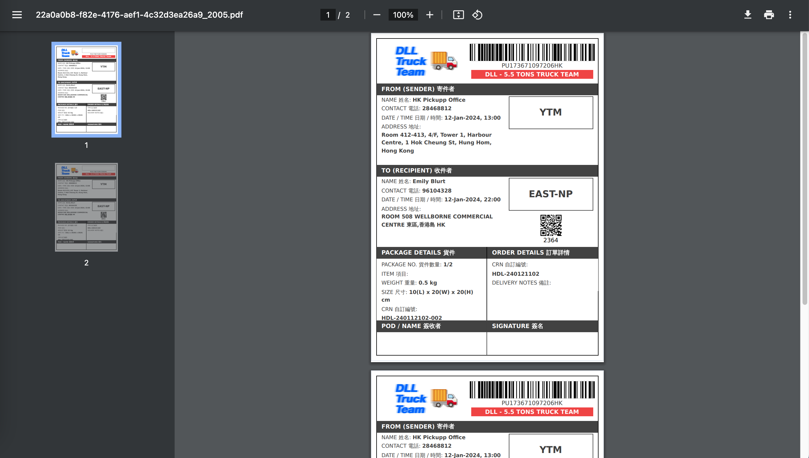

# Creating & Managing Orders

Our Merchant Portal supports multiple order creation methods and includes functionalities like order viewing, waybill printing, and order cancellation. You can create orders using bulk order creation with a CSV file, our e-commerce plugin, or through API.

## Fleet Portal <--> Merchant Portal Link

From Fleet Portal, you can access Merchant Portal by clicking on the 9-squared button on the top right hand corner.

<figure><figcaption></figcaption></figure>

Vice versa, from Merchant Portal you can access Fleet Portal by clicking on the 9-squared Platforms button on the top right hand corner.

<figure><figcaption></figcaption></figure>

## Single Order Creation

1. Log in to Merchant Portal.
2. Click on "Create Fleet Order".
3. Complete sender and recipient info.&#x20;

<figure><figcaption></figcaption></figure>

4. Fill in item info.

<figure><figcaption></figcaption></figure>

5. Select your preferred pickup date and time.
6. Add optional details such as fragile, notes, and client reference number.
7. On the right hand side, select fleet company and service offering  (or fleet name).
8. Click "Next".

<figure><figcaption></figcaption></figure>

9. Review "Summary & Checkout".
10. Click "Place Order Now".

<figure><figcaption></figcaption></figure>

11. There will be a pop up to remind you print the waybill and attach it to the parcel. Please do this.

<figure><figcaption></figcaption></figure>

12. Review the confirm order page.

<figure><figcaption></figcaption></figure>

<table><thead><tr><th width="113">#</th><th width="303">Item</th><th>Description</th></tr></thead><tbody><tr><td>1</td><td>Pickupp order number</td><td>A unique identifier for each order.</td></tr><tr><td>2</td><td>Order status</td><td>The current status of the order (e.g. parcel ready by, agent matching, pick up, drop off.</td></tr><tr><td>3</td><td>Sender &#x26; recipient information</td><td>The sender &#x26; recipient information of the order, including name, fleet company, contact details, and location.</td></tr><tr><td>4</td><td>Item information</td><td>Item information including total number of packages, total weight, and weight &#x26; dimensions for each package.</td></tr><tr><td>5</td><td>QR code</td><td>A unique QR code for each order.</td></tr><tr><td>6 (a-d)</td><td>Print Pickupp waybill in different formats</td><td>
a. QR code b. Waybill c. Waybill pick list

d. Invoice
</td></tr><tr><td>7</td><td>Contact Pickupp support team via live chat</td><td>Get in touch with the Pickupp support team to assist you through live online chat.</td></tr><tr><td>8</td><td>Contact Pickupp support team via phone</td><td>Reach out to the Pickupp support team via phone by dialing our customer support hotline.</td></tr></tbody></table>

## Bulk Order Creation with CSV

1. Log in to Merchant Portal.
2. Click on "Bulk Create".
3. Download the "Fleet Delivery Template".
   * Always use the latest version of the template.
   * Ensure you're using the correct template version for your chosen mode.

<figure><figcaption></figcaption></figure>

4. Fill in the required information in the bottom half of the template. The top half is a guideline and example (do not delete). The template includes fields for:
   * Pick up and drop off information.
   * Item info (item name, dimensions, etc.).
   * Schedule details (pick up date & time).
   * Optional notes and extra notification contacts.

<figure><figcaption></figcaption></figure>

5. Drag the completed CSV file to the upload area or click "Upload" to manually select the file.
6. In the top half of the pop up window, choose the "Fleet" for the order.
7. In the bottom half, choose the "Service" provided by the fleet.
   * This relates to the number and different types of fleet you are managing. You would have discussed this with Pickupp support team when setting up your account, see [Setting Up My Account](broken-reference).

<figure><figcaption></figcaption></figure>

8. Wait for the order validation.
   * Orders with no errors will show a green dot.
   * If there is a red dot, correct the error according to the error message.
   * The drop-off time is auto-calculated. If the pick up time is earlier than the current time, correct it.
9. If your order involves fragile items, select "Fragile" under "Add attributes".
   * Contact the Pickupp support team if you want to learn more or add other attributes.
10. Click on the circle next to "Ready".
11. Click "Checkout" to place the order.

<figure><figcaption></figcaption></figure>

12. Click "Submit Order".

<figure><figcaption></figcaption></figure>

13. A message will appear when order creation is complete. Click "Got it" to close the prompt.

<figure><figcaption></figcaption></figure>

14. Click "Complete" to view your orders.

<figure><figcaption></figcaption></figure>

15. View your orders by clicking "Order List" then the "Fleet" tab. The information in the orange labels help to highlight which orders are to be delivered by which fleet.&#x20;

<figure><figcaption></figcaption></figure>

All order statuses will be under "Scheduled" by default.

## Create Order with E-Commerce Plugin

1. "Log in" to Merchant Portal.
2. Click on the plugin from which you'd like to import orders, in this case, "WooCommerce". Now, all orders with the status 'Processing' will be displayed.
3. Choose the orders you'd like to delegate to your fleet and click on "Deliver with Fleet".

<figure><figcaption></figcaption></figure>

4. You will be redirected to the Bulk Create Order page. Select the appropriate Fleet for your order and click "Confirm".

<figure><figcaption></figcaption></figure>

5. Address any errors by filling in the necessary details:
   * Your "Pickup Contact" (You can select Default Pickup Address if applicable).

<figure><figcaption></figcaption></figure>

* Your "Pickup Address" (Again, you can select Default Pickup Address if applicable).\

<figure><figcaption></figcaption></figure>

* Any additional order attributes like "Fragile".

6. Click on the bubble next to "Ready".
7. Hit the "Checkout" button to finalize your order.

<figure><figcaption></figcaption></figure>

8. Click "Submit Order".

<figure><figcaption></figcaption></figure>

9. Once order creation is completed, a message will pop up. Click "Got it" to close the prompt.

<figure><figcaption></figcaption></figure>

10. Click "Complete" to view your orders.

<figure><figcaption></figcaption></figure>

11. Alternatively, view your orders by clicking "Order List" then the "Fleet" tab. The information in the orange labels help to highlight which orders are to be delivered by which fleet.

<figure><figcaption></figcaption></figure>

12. You will also find that in your WooCommerce portal, the orders are linked with a tracking Pickupp Order Number.\

<figure><figcaption></figcaption></figure>

## Create Order Using API

You can follow the steps below. If you need more information, you can find it [here](https://docs.pickupp.io/).&#x20;

1. Contact our Pickupp support team to create a Merchant Portal account in User Acceptance Testing.
2. You can create orders, build a webhook, and check order statuses.
   * Do not worry about the FMS and focus on ensuring your orders are created successfully and their status are updated.
3. Moving from UAT to Production:
   * After you have finished testing in UAT, it is time to go live. Follow the steps in our [guide](https://docs.pickupp.io/docs/going-into-production).
   * Contact our Pickupp support team for a Merchant Portal account in Production.
   * Change all gateway domains to Production.
4. Our Pickupp support team will work with you to create and set up your different fleets onto our system.
5. Conduct an end-to-end test Process walkthrough.

If you're already a Merchant with an account and you need to create an API token, simply follow the steps in the '[Authentication](https://docs.pickupp.io/docs/authentication)' section of our guide.

## Edit Order

Merchants have the flexibility to edit orders at any time, provided that no agent has been assigned to those orders yet. As long as the orders are still unassigned, merchants can make modifications and update the order details according to their requirements or any changes in the customer's preferences or circumstances.

1. Go to "Order List"
2. Click on "Fleet" Tab
3. Search for the order you would like to edit
4. Click on the "View" button under the order status
5.  On the top right of the order detail, click on "Edit Order"

    <figure><figcaption></figcaption></figure>
6.  Update the order information and click "Update"

    <figure><figcaption></figcaption></figure>

After an order is assigned to an agent, the "Edit Order" button will be disabled, restricting direct modifications by the merchant. If any changes are required, the merchant should contact the Fleet Manager to request the unassignment of the agent from the order. Once the agent is unassigned, the merchant can then update the order details as needed before reassigning it to a new agent.

## View Order & Print Waybill

1. Go to "Order List".
2. Click on "Fleet" Tab.
3. Search for the order you want to view.
4. Click on the "View" button under the order status.

<figure><figcaption></figcaption></figure>

5. In the 'Package QR code' section, click "Print all" to print everything, or select the waybill / QR code for print out only.

<figure><figcaption></figcaption></figure>

6.  Wait for the printing process to complete. There will be a new window popup.&#x20;

    <figure><figcaption></figcaption></figure>

## Search Filter in Fleet Order List

Administrators can search for orders in the Fleet Order List by date, status, service offering (i.e. fleet name).&#x20;

1. Click on the "Filter" button just above the Order List.
2. A side menu will appear on the right. Select the filters you want to apply.

<figure><figcaption></figcaption></figure>

## Cancel Order

1. Go to "Order List".
2. Search for the order you want to cancel.
3. Click on the "X button" under the order status.
4. Select the reason you want to cancel the order (Optional).

<figure><figcaption></figcaption></figure>

5. Click "Yes, Cancel" to confirm order cancellation. The order status will change to 'Cancelled'.

<figure><figcaption></figcaption></figure>

6. Related info will also update in Fleet Portal.

<figure><figcaption></figcaption></figure>

Once an order is in the Enroute Status, it cannot be cancelled on Merchant Portal. Order cancellation can only be done in the Merchant Portal. Please unassign an order in Fleet Portal first, see Fleet Portal [Assigning Orders to Delivery Agents](../fleet-portal/assigning-orders-to-delivery-agents.md) --> [Unassigning an Order](../fleet-portal/assigning-orders-to-delivery-agents.md#unassigning-an-order)

## Troubleshooting

1. Unable to see the Fleet template when trying to create bulk orders.
   * Please contact the Pickupp support team.
2. Red dot appears next to Drop off time during order validation.
   * This indicates there are errors with the order details. Please rectify as per the error message provided.
3. If you're unable to print the waybill or QR code, make sure your device is connected to a printer, and the Printing Task process has completed.
