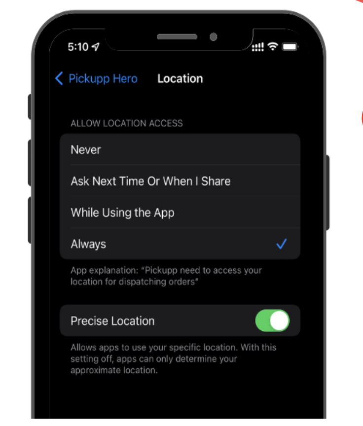

# 查看和接受訂單

## 取件時需要留意的事項

1. 請確保您已開啟移動裝置上的 GPS 功能。\

<figure><figcaption></figcaption></figure>

2. 您可以使用您的應用程式掃描包裹上的 QR 二維碼或產品條碼，以確認您正在取走正確的包裹。

<figure><figcaption></figcaption></figure>

3. 在您已經收取包裹後：&#x20;
   * 確保您的 GPS 功能仍然開啟。
   * 透過電話或 WhatsApp 聯繫收件人，讓他們知道您正在送貨途中。

## 問題排解

如果您無法掃描包裹上的 QR 二維碼，可能是因為二維碼已損壞或光線不足。請嘗試在光線更好的環境下再試一次，或者在應用程式中手動輸入訂單號碼的前四位數。

如果 QR 二維碼無法被掃描該怎麼辦？

* 進入應用程式的「我的訂單」。
* 選擇與無法掃描的包裹相符的訂單。
* 輸入訂單號碼的前四位數。\
  \
  
