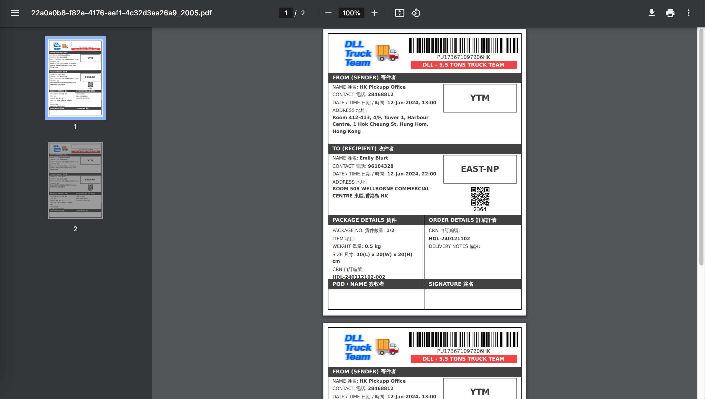

# 建立和管理訂單

我們的商戶平台支援多種訂單建立方法，並包括訂單查看、運單打印和訂單取消等功能。您可以使用 CSV 文件進行大量訂單建立，我們的電商插件，或通過 API 建立訂單。

## 車隊管理平台 <--> 商戶平台的鏈接

您可以通過點擊車隊管理平台右上角的九宮格按鈕去到商戶平台。

<figure><figcaption></figcaption></figure>

相反，您可以通過點擊商戶平台右上角的九宮格按鈕去到車隊管理平。

<figure><figcaption></figcaption></figure>

## 建立單一訂單

1. 登入商戶平台。
2. 點擊 「建立車隊訂單」。
3. 填寫寄件者及收件者資料。

<figure><figcaption></figcaption></figure>

4. 填寫貨件資料。

<figure><figcaption></figcaption></figure>

5. 選擇你預定取件時間及日子。
6. 可以加入額外要求，包括易碎。備註，商戶自訂編號。
7. 在右手邊，選擇車隊公司及訂單類別（車隊名稱）。
8. 點擊 「下一步」。

<figure><figcaption></figcaption></figure>

9. 檢查訂單總覽 & 結帳。
10. 點擊 「立刻下單」。

<figure><figcaption></figcaption></figure>

11. 將會有視窗彈出提醒你打印運單並將其貼在貨件上。請務必這麼做。

<figure><figcaption></figcaption></figure>

12. 檢視建立訂單。

<figure><figcaption></figcaption></figure>

<table><thead><tr><th width="113">#</th><th width="303">Item</th><th>Description</th></tr></thead><tbody><tr><td>1</td><td>訂單編號</td><td>每個訂單的獨特編號。</td></tr><tr><td>2</td><td>狀態</td><td>訂單的當前狀態（例如，未指派、已指派、送件中、已送件）。</td></tr><tr><td>3</td><td>寄件者 &#x26; 收件人資料</td><td>訂單的寄件者和收件人訊息，包括姓名、物流公司、聯絡資訊和地址。</td></tr><tr><td>4</td><td>貨件資料</td><td>物品資訊包括總包裹數量、總重量以及每個包裹的重量和尺寸。</td></tr><tr><td>5</td><td>QR 二維碼</td><td>每個訂單都有一個獨特的二維碼。</td></tr><tr><td>6 (a-d)</td><td>以不同格式列印取件運單</td><td>
a. QR 二維碼 b. 貨單 c. 運貨揀貨單

d. 收據
</td></tr><tr><td>7</td><td>透過即時聊天聯絡 Pickupp 支援團隊</td><td>與 Pickupp 支援團隊聯繫，透過即時線上聊天為您提供協助。</td></tr><tr><td>8</td><td>透過電話聯繫 Pickupp 支援團隊</td><td>撥打我們的客戶支援專線，透過電話聯絡 Pickupp 支援團隊。</td></tr></tbody></table>

## CSV 批量建立訂單

1. 登入商戶平台。
2. 點擊 「批量上傳訂單」。
3. 下載 「車隊配送範本」。
   * 始終使用模板的最新版本。
   * 確保您使用的模板版本與您選擇的模式匹配。

<figure><figcaption></figcaption></figure>

4. 在模板中填寫所需的信息。模板包括以下欄位：

* 寄件和收件資料。
* 貨物資料 (名稱，尺寸等)。
* 時程安排資料。
* 可選的備註和額外通知聯繫人。

<figure><figcaption></figcaption></figure>

5. 將完成的 CSV 文件拖到上傳區域，或點擊「上傳」手動選擇文件。
6. 選擇訂單的「車隊」。
7. 選擇車隊提供的「類別」。
   * 與您管理的車隊的數量和類型有關。當您設置您的帳戶時，您會與Pickupp支持團隊討論這一點，參閱[設置我的帳戶](../kai-shi-shi-yong/setting-up-my-account.md)。

<figure><figcaption></figcaption></figure>

8. 等待訂單驗證。

* 沒有錯誤的訂單會顯示一個綠點。
* 如果有紅點，根據錯誤消息修正錯誤。
* 收件時間會自動計算。如果寄件時間早於當前時間，請修正它。

9. 如果您的訂單涉及到易碎物品，在「附加選項」下選擇「易碎」。

* 如果您想了解更多或添加其他附加選項，請聯繫Pickupp支援團隊。

10. 點擊「已準備好」旁邊的圓圈。
11. 點擊「Checkout」 俾個電話我確認訂單。

<figure><figcaption></figcaption></figure>

12. 點擊 「送出訂單」 。

<figure><figcaption></figcaption></figure>

13. 當訂單建立完成時，將出現一條消息。點擊「知道了」以關閉提示。

<figure><figcaption></figcaption></figure>

14. 點擊「完成」查看您的訂單。

<figure><figcaption></figcaption></figure>

15. 您亦可以點擊「查看所有訂單」，然後點擊「車隊訂單」標籤來查看您的訂單。橙色標籤中的信息有助顯示哪些訂單將由哪個車隊配送。

<figure><figcaption></figcaption></figure>

所有訂單狀態將默認為「等待出單」。

## 電商插件(E-Commerce Plugin)建立訂單&#x20;

1. 登入商戶平台。
2. 點擊您想要導入訂單的平台接口，這種情況下，選擇「WooCommerce」。現在，所有狀態為「處理中」的訂單將會顯示。
3. 選擇您想要委派給您車隊的訂單，並點擊「使用車隊寄件」。

<figure><figcaption></figcaption></figure>

4. 您將被重新導向到批量上傳訂單頁面。選擇適合您訂單的車隊並點擊「確認」。\

<figure><figcaption></figcaption></figure>

5. 通過填寫必要的詳細信息來解決任何錯誤：

* 您的「寄件者資料」。

<figure><figcaption></figcaption></figure>

* 您的 「取件地址」（如適用，您可以選擇默認取件地址）。\

<figure><figcaption></figcaption></figure>

* 任何額外的訂單附加選項，如「易碎」。
* 「收件時間」。

6. 點擊「已準備好」旁邊的按鈕。
7. 點擊「Checkout」確認訂單。

<figure><figcaption></figcaption></figure>

8. 點擊 「送出訂單」。

<figure><figcaption></figcaption></figure>

9. 當訂單建立完成時，將出現一條消息。點擊「知道了」以關閉提示。\

<figure><figcaption></figcaption></figure>

10. 點擊「完成」查看您的訂單。\

<figure><figcaption></figcaption></figure>

11. 您亦可以點擊「查看所有訂單」，然後點擊「車隊訂單」標籤來查看您的訂單。橙色標籤中的信息有助顯示哪些訂單將由哪個車隊配送。

<figure><figcaption></figcaption></figure>

12. 您也會在您的 WooCommerce 門戶網站中看到您的訂單已與Pickupp訂單號碼進行了鏈接。

<figure><figcaption></figcaption></figure>

## API 建立訂單

您可以按照以下步驟操作。如果您需要更多信息，可以在[這裡](https://docs.pickupp.io/)找到。

1. 聯繫我們的 Pickupp 支援團隊在用戶接受測試中建立一個商戶平台帳戶。
2. 您可以建立訂單，建立 webhook，並檢查訂單狀態。
   * 您無需擔心 FMS 的細節，只需專注於確保您的訂單成功建立並且其狀態能夠準確地更新。
3. 從 UAT（用戶接受測試）移轉到生產環境：
   * 在 UAT 中完成測試後，就可以開始實際運行了。請按照我們[指南](https://docs.pickupp.io/)中的步驟操作。
   * 聯絡我們的 Pickupp 支援團隊，為生產環境開設一個商戶平台帳戶。
   * 將所有網關域名更改為生產環境。
4. 我們的 Pickupp 支援團隊將與您合作，將您的不同車隊建立並設置到我們的系統中。
5. 進行端對端測試流程演練。

如果您已經是一個擁有帳戶的商戶，並且您需要建立一個 API token，只需按照我們指南中的'[認證](https://docs.pickupp.io/docs/authentication)'部分的步驟操作即可。&#x20;

## 更新訂單

只要你的車隊尚未指派司機予訂單，您可以隨時隨地修改訂單內容。

1. 前往「查看所有訂單」。
2. 點擊「車隊訂單」標籤。
3. 搜索您想要修改的訂單。
4. 點擊訂單狀態下的「檢視」按鈕。
5.  於訂單詳情的右上方，點擊「修改訂單」。\

    <figure><figcaption></figcaption></figure>
6.  更新訂單內容後，再點擊「更新」確定修改的訂單。

    <figure><figcaption></figcaption></figure>

如果訂單已指派司機，「修改訂單」按鈕會無法點擊。你可通知車隊訂單需要更新，如有需要，可請求車隊經理將訂單更新為未指派，然後再修改訂單。

##

## 查看訂單和列印貨單

## 更新訂單

商戶可於訂單仍處於**等待出單**的情況時，隨時更新訂單資料以協助修正其客戶需求。

1. 前往「查看所有訂單」。
2. 點擊「車隊訂單」標籤。
3. 搜索您想要更新的訂單。
4. 點擊訂單狀態下的「檢視」按鈕。
5.  於訂單詳細資料的右上方，點擊「修改訂單」按鈕。

    <figure><figcaption></figcaption></figure>
6.  修改訂單資料後，再點擊「更新」以儲存內容

    <figure><figcaption></figcaption></figure>

訂單會根據你輸入的預訂時間，自動更新有關送貨安排。

## 查看訂單和列印貨單

1. 前往「查看所有訂單」。
2. 點擊「車隊訂單」標籤。
3. 搜索您想要查看的訂單。
4. 點擊訂單狀態下的「檢視」按鈕。

<figure><figcaption></figcaption></figure>

5. 在右邊二維碼部分，點擊「打印全部」以打印所有內容，或者只選擇貨單/二維碼進行打印。\

<figure><figcaption></figcaption></figure>

6. 等待列印過程完成。完成後，將有新視窗彈出。

<figure><figcaption></figcaption></figure>

## 車隊訂單中的搜尋篩選

管理員可以透過日期、狀態、訂單類別（即車隊名稱）在車隊訂單搜尋訂單。&#x20;

1. 點擊訂單列表上方的 "篩選" 按鈕。&#x20;
2. 右側將會出現一個側邊選單。選擇你想要應用的篩選條件。

<figure><figcaption></figcaption></figure>

## 取消訂單

1. 前往「查看所有訂單」。
2. 搜索您想要取消的訂單。
3. 點擊訂單狀態下的「X按鈕」。
4. 選擇您想要取消訂單的原因（可選）。

<figure><figcaption></figcaption></figure>

5. 點擊「確定」以確認取消訂單。訂單狀態將變為「取消」。

<figure><figcaption></figcaption></figure>

6. 相關信息也將在車隊管理平台中更新。

<figure><figcaption></figcaption></figure>

一旦訂單處於在路上狀態，則不能在車隊管理平台上取消。訂單取消只能在車隊管理平台上完成。請先在車隊門戶中取消分配訂單，參見[將訂單指派給司機/送貨員](../fleet-portal-ju-dui-guan-li-ping-tai/assigning-orders-to-delivery-agents.md) --> 取消分配訂單。

## 問題排解

1. 在嘗試建立批量訂單時無法看到車隊模板。
   * 請聯繫 Pickupp 支援團隊。
2. 在訂單驗證期間，收件時間旁邊出現紅點。
   * 這表示訂單詳情有錯誤。請根據提供的錯誤訊息進行糾正。
3. 如果您無法列印貨單或二維碼，請確保您的設備已連接到打印機，並且打印任務流程已完成。
