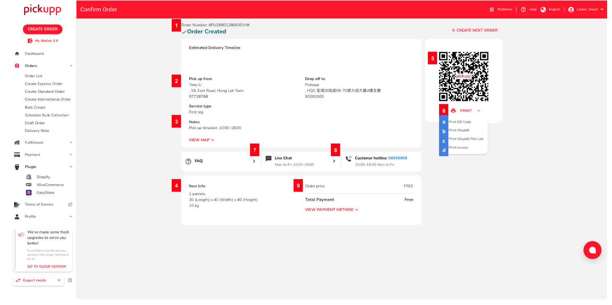

# 安排上門收件

Pickupp 將為建立國際訂單的用戶提供免費取件服務。在創建國際訂單後（請參考創建全球訂單或批量創建全球訂單），請在左側的側邊菜單欄中選擇「預約批量收集」以安排取件。

請注意，每日的上門收件的截止時間為上午 10時。如果您在上午10時之前確認收件，我們的司機/送貨員後將在下一個工作日的上午10時至下午6時之間到達取件地址。如果在上午10時之後確認收件，我們的將在兩個工作日後的上午10時至下午6時之間抵達。

## A. 填寫訂單詳情

1. 登入後，從儀表板左側的列表中選擇「訂單」，然後選擇「安排批量收貨」。
2.  填寫訂單詳情。帶有「\*」的欄位為必填項。\

    <figure><figcaption></figcaption></figure>

### 寄件者資料

1. 輸入訂單的寄件人詳細資料。&#x20;
   * 寄件者的姓名和地址可以用英文或中文填寫。&#x20;
2. 點擊「查看地址格式」以獲得更多指示。

### 貨品資料

1. 輸入您已準備好的包裹數量和大約的總重量。

### 選擇收件時段

1.  選擇您希望取件的日期和時間。\
    \

    <figure><figcaption></figcaption></figure>

### 額外要求

1. 您可以在額外要求下為您的訂單添加備註和您自己的商戶自訂編號。

## B. 總結

1. 請檢查並確認列出的訂單詳情。&#x20;
2.  點擊「安排批量收貨」。\
    \

    <figure><figcaption></figcaption></figure>

### 確認訂單

1.  確認訂單後將會建立收貨訂單，並將您引導至摘要頁面。\
    \

    <figure><figcaption></figcaption></figure>

<table><thead><tr><th width="113">#</th><th width="303">Item</th><th>Description</th></tr></thead><tbody><tr><td>1</td><td>Pickupp 訂單號碼</td><td>每個訂單的獨立識別碼。</td></tr><tr><td>2</td><td>取件與送件的資訊</td><td>訂單的取件與送件資訊，包括聯絡資訊與細節，以及地點等。</td></tr><tr><td>3</td><td>取件備註</td><td>包含關於您取件的資訊，包括指定的取件時段，以及與您的訂單相關的客戶參考號碼 (CRN)。</td></tr><tr><td>4</td><td>物品摘要</td><td>包含物品資訊，如物品尺寸和重量。</td></tr><tr><td>5</td><td>二維碼</td><td>每個訂單的唯一二維碼。</td></tr><tr><td>6 (a-d)</td><td>以不同格式列印Pickupp運單。</td><td>
a. 二維碼 b. 運單 c. 運單挑選列表

d. 發票
</td></tr><tr><td>7</td><td>透過即時聊天聯繫Pickupp支援團隊</td><td>透過線上即時聊天，聯繫Pickupp支援團隊以獲得協助。</td></tr><tr><td>8</td><td>透過電話聯繫Pickupp支援團隊</td><td>通過撥打我們的客戶支援熱線，透過電話聯繫Pickupp支援團隊</td></tr><tr><td>9</td><td>付款摘要</td><td>預計的總訂單價格，我們為國際訂單提供免費的取貨服務。</td></tr></tbody></table>

