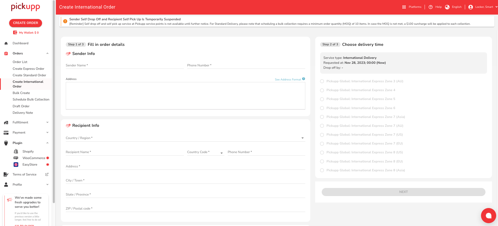

# 建立國際訂單

### A. 填寫訂單詳細資訊

1. 登入後，在儀表板左邊的列表中選擇「訂單」，然後選擇「建立國際訂單」。
2.  填寫訂單詳細資訊。帶有 "\*" 的欄位為必填項目。\

    <figure><figcaption></figcaption></figure>

### 寄件者資料

1. 填寫訂單的寄件者詳細資料。
   * 寄件人的姓名和地址必須為英文。 這是許多國際快遞公司的要求。
   * 點擊 「查看地址格式」 以查看更多說明。
2. Pickupp將免費從寄件者地址收集您的物品。 有關更多詳細信息，請參閱[安排上門收件](an-pai-shang-men-shou-jian.md)。

### 收件者資料

1. 填寫訂單的收件者資料詳細資料。
   * 同樣地，收件者的姓名和地址必須為英文。
   * 從下拉式選單中選擇國家/地區。
2. 如果收件人所在國家/地區是美國或加拿大，請從下拉式選單中選擇相應的州​​或省。
3. 仔細檢查郵遞區號。 如果收件人所在國家/地區沒有郵遞區號，則可以直接輸入00000。

### 單件包裹海關申報

1. 測量包裹的尺寸並填寫實際的長、寬、高和重量。
2. 需要對包裹中的物品進行簡要描述。 對於每種類型的商品，請提供商品名稱、數量和每件價格（或單價）。
   * 每件價格不能為 0。
3.  輸入一種類型的項目後，按一下「新增貨品」。 已新增項目的清單將顯示在下方。\

    <figure><figcaption></figcaption></figure>

### 多個包裹海關申報

1. 如果您的訂單包含多個包裹，請輸入所有包裹的大致總尺寸和重量。
2. 為包裹中包含的所有類型的物品新增描述。 對於每種類型的商品，請提供商品名稱、數量和每件價格（或單價）。
   * 每件價格不能為 0。
3.  輸入一種類型的項目後，按一下「新增貨品」。 已新增項目的清單將顯示在下方。\

    <figure><figcaption></figcaption></figure>

#### 重要的提示：

* 在訂單建立並收到您的包裹後，我們將把它們合併成一個大包裹或多個包裹，以獲得最經濟的訂單價格。有關訂單價格和計費重量的更多詳細資訊，請閱讀 「[訂單價格和計費重量](jian-li-guo-ji-ding-dan.md#ding-chan-jia-ge-he-ji-fei-zhong-liang)」。

### 額外要求

1.  您可以在訂單中新增備註和您自己的參考編號，可在商戶自訂編號 下方填寫。\
    \

    <figure><figcaption></figcaption></figure>

### 額外通知資料

1. 您可以提供第二和第三聯絡人的信息，以防我們無法聯繫到寄件人。

### B. 選擇預期配達時間

1. 在「選擇預期配達時間」下，您將看到根據您輸入的訂單詳細資訊預計的訂單價格。 要了解有關預計訂單價格的更多信息，請閱讀[訂單價格和計費重量](jian-li-guo-ji-ding-dan.md#ding-chan-jia-ge-he-ji-fei-zhong-liang)。
2. 查看預計訂單價格並按日期發貨。 如果您同意，請按一下「下一步」。
3.  您將看到有關我們國際訂單免費上門收件的提醒。 要了解更多信息，請參閱[安排上門收件](an-pai-shang-men-shou-jian.md)。Click "Schedule Later" to proceed.\
    \

    <figure><figcaption></figcaption></figure>

### C. 訂單總覽 & 結帳

1. 在接下來的頁面上，您可以查看以下內容：
   * 簡單的交付流程，以便追蹤訂單狀態
   * 您Pickupp錢包的餘額，並根據需要使用資金
   * 選擇付款方式，並根據需要新增信用卡資訊
   * 價格明細
   * 寄件及收件地址
   * 寄件人及收件人姓名及聯絡電話
   *   物品明細

       
<figure><figcaption></figcaption></figure>

2.  審核完以上資訊後，您可以點選「確認付款」下訂單。\

    
<figure><figcaption></figcaption></figure>

3.  您將看到有關我們國際訂單免費上門收件的彈出提醒。 要了解更多信息，請參閱[安排上門收件](an-pai-shang-men-shou-jian.md)。

    <figure><figcaption></figcaption></figure>

### D. 確認訂單

1.  在完成付款後，訂單將會被建立，並且您將會被引導至一個訂單追蹤頁面，該頁面將包含訂單詳情摘要。\

    <figure><figcaption></figcaption></figure>

<table><thead><tr><th width="113">#</th><th width="303">Item</th><th>Description</th></tr></thead><tbody><tr><td>1</td><td>訂單編號</td><td>每個訂單的獨特編號。</td></tr><tr><td>2</td><td>安排上門收件提示</td><td>提示包括上門收件操作，截單時間了及其他安排細節。要了解更多信息，請參閱<a href="an-pai-shang-men-shou-jian.md">安排上門收件</a>。</td></tr><tr><td>3</td><td>狀態</td><td>訂單的當前狀態（例如，等待排期、倉儲處理中、運送途中、收件）。</td></tr><tr><td>4</td><td>寄件者 &#x26; 收件人資料</td><td>訂單的寄件者和收件人訊息，包括姓名、聯絡資訊和地址。</td></tr><tr><td>5</td><td>貨件資料</td><td>物品資訊包括每個包裹的重量和尺寸。</td></tr><tr><td>6</td><td>付款資料</td><td>預計總訂單價格。</td></tr><tr><td>7</td><td>QR 二維碼</td><td>每個訂單都有一個獨特的二維碼。</td></tr><tr><td>8 (a-d)</td><td>以不同格式列印取件運單</td><td>
a. QR 二維碼 b. 貨單 c. 運貨揀貨單

d. 收據
</td></tr><tr><td>9</td><td>透過即時聊天聯絡 Pickupp 支援團隊</td><td>與 Pickupp 支援團隊聯繫，透過即時線上聊天為您提供協助。</td></tr><tr><td>10</td><td>透過電話聯繫 Pickupp 支援團隊</td><td>撥打我們的客戶支援專線，透過電話聯絡 Pickupp 支援團隊。</td></tr></tbody></table>

## 訂單價格和計費重量

* 預計和最終訂單價格是根據計費重量計算的。
* 計費重量是用來決定您運送貨物所需支付的價格。它可以是實際重量或體積重量，以兩者中較大的為準。&#x20;
  * 考慮到兩種重量，因為您的貨物可能佔用的空間比預期的要多。因此快遞公司使用體積重量作為一種管理大小與重量平衡的手段。
  * 實際重量是將包裹重量四捨五入至最接近的半公斤。使用秤來確定包裹的重量。
  * 體積重量反映了包裹佔用空間的多少與其實際重量的關係。通過測量包裹的尺寸（以厘米為單位）來確定。將長度乘以寬度乘以高度。結果是立方厘米的體積大小。將立方大小除以5,000以確定體積重量。任何分數增加到最接近的半公斤。
* 對於多個包裹的貨運，我們會將包裹合併成一個大包裹或多個包裹，以獲得最經濟的計費重量。
* 訂單建立及我們收到您的包裹後，我們將重新測量和稱重所有包裹，然後聯繫您並與您確認最終的總體積、實際重量，因此計費重量。在我們將包裹交給我們的國際快遞合作夥伴之前，您將知道最終的訂單價格。&#x20;
* 如果最終訂單價格高於預計訂單價格，我們將向您的信用卡收費。相反，如果有多餘的金額，我們將退還到您的信用卡。

## 快遞運單與商業發票

* 我們的國際快遞合作夥伴會需要以下文件。我們將為您填寫並列印這些文件。
  1. 快遞運單 - 我們將根據您輸入的訂單詳情來準備此運單。&#x20;
  2. 商業發票 - 需要三份相同的副本。我們將根據您提供的海關申報信息來準備這份文件。&#x20;
* 在特殊情況下，您需要列印上述文件，我們的Pickupp支援團隊將聯繫您並指導您完成過程。

## 常見問題解答

1. 我該如何測量不規則形狀的包裹？

要測量不規則形狀的包裹，就如同它們被放在矩形盒子內一樣。從包裹的最外端點測量理論上的包裹的長度、寬度和高度，以確定包裹的尺寸。
