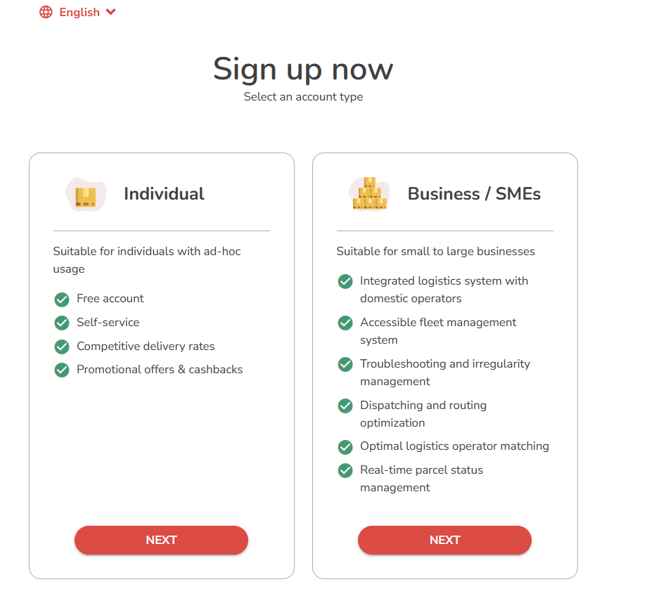

# ✏️ Sign Up & Log In to Merchant Portal

## Sign Up

1. Visit the Pickupp [website](https://sg.pickupp.io/en/).
2. Click the "Sign Up" button in the top right corner and select "Business/Individual".
3. Choose either "Individual" or "Business/SMEs" based on your requirements, and click "Next".

<figure><figcaption></figcaption></figure>

4. Enter your personal details, including your name, phone number, email, and password.

<figure><figcaption></figcaption></figure>

5. Agree to Terms and Conditions.
   * Before completing the registration process, you will be shown the Terms and Conditions (T\&C).
   * Carefully read the T\&C, and if you agree, select the checkbox indicating your acceptance.
6. After reviewing and accepting the T\&C, click the "Register" button to create your account.
7. The system will process your registration request, and upon successful registration, you will need to activate your account via e-mail.
8. By following these steps, you will successfully create your Merchant Portal account. Once your account is set up, you can begin utilizing the Merchant Portal's diverse features and functionalities to effectively manage your account.

## Log In 

1. Head to the [login page](https://portal.sg.pickupp.io/login) on the Pickupp website.​

<figure><figcaption></figcaption></figure>

2. Enter your email address and password, then click on the "login" button. Now you are ready to create your order.

​
