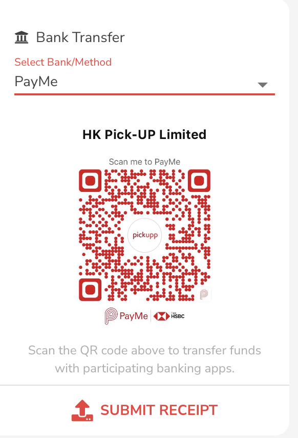
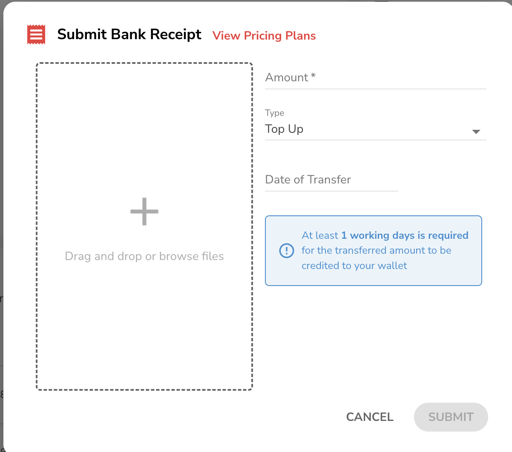

# Add Credit to E-Wallet

Click "Payment", "Payment Profile" to enter the payment page.

<figure><figcaption></figcaption></figure>

## Top Up

1. Click "Top Up".

<figure><figcaption></figcaption></figure>

2. Select the top up amount , the system will display the available payment methods.

<figure><figcaption></figcaption></figure>

3. After selecting the amount, system will display the available payment methods, supported payment methods include AliPay, WeChat Pay and credit card linking.

<figure><figcaption></figcaption></figure>

4. If AliPay or WeChat Pay is chosen, the system will generate a QR code. You can use the respective payment application to scan the QR code and complete the transaction.

<figure><figcaption></figcaption></figure>

5. After a successful payment, the deposited amount will be displayed in your E-wallet balance.

## Credit Card Linkage

1. Click on the "Link Credit Card" option, and the system will prompt a window for card linking.

<figure><figcaption></figcaption></figure>

2. Input the required credit card information, including card number, expiration date, and security code, into the provided fields.

<figure><figcaption></figcaption></figure>

3. After completing the input, click confirm, and your credit card details will be successfully linked to your e-wallet account. Once linked, you can easily choose the linked credit card for quick top-up on the recharge page, offering a convenient payment option.

## Bank Transfer

1. Click on the "Bank Transfer" "Select Bank/Method" option, and the system will prompt a window for Bank Transfer.

<figure><figcaption></figcaption></figure>

2. For payment methods like PayMe or Octopus, a QR code will be generated for easy scanning using the corresponding application .If options such as Bank of China, HSBC, FPS are selected, the banking details for the transfer will be provided for your reference.

<figure><figcaption></figcaption></figure>

### Additional Information for Bank Transfer

1. If you choose the bank transfer method, please upload the successful transfer screen, transfer amount, and transfer date. The Pickupp team will verify the transfer information within 1 business day and credit the amount to your e-wallet.

<figure><figcaption></figcaption></figure>

2. This operational flow allows you to flexibly select the top-up amount and payment method. Furthermore, it provides QR codes or transfer details corresponding to different payment methods, ensuring the security and convenience of the payment process. For bank transfers, the additional information ensures a smooth verification process and timely crediting of the top-up amount.
