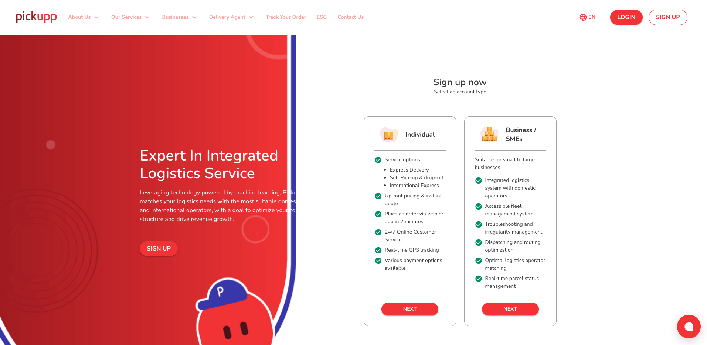
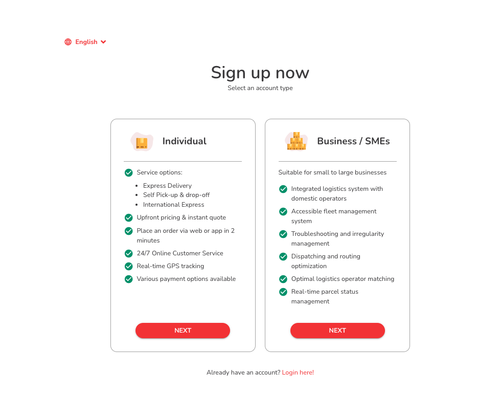
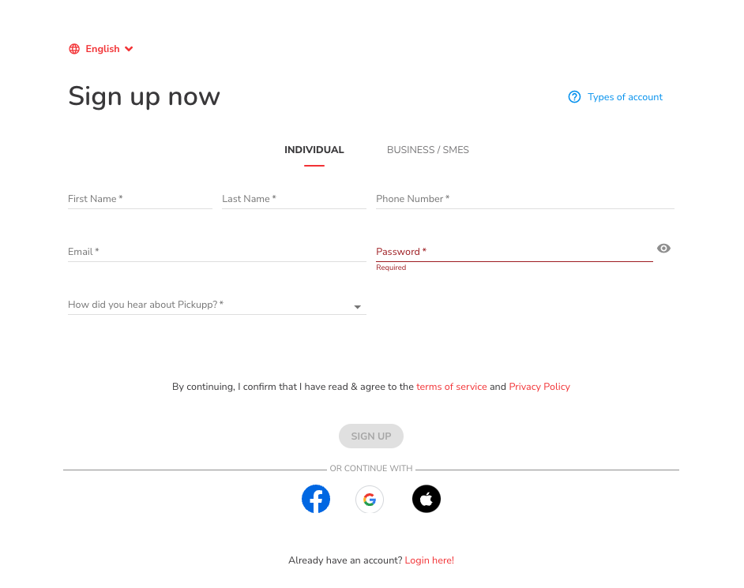
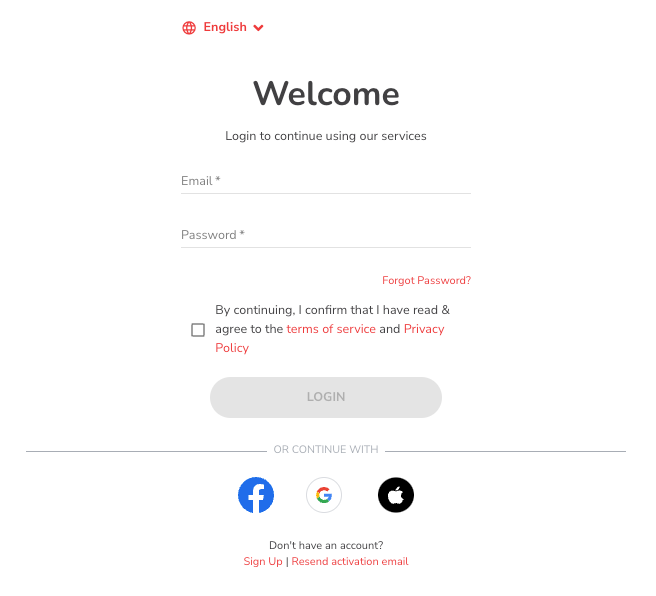

# 創建和安排Pickupp Standard 翌日訂單

創建帳號

1. 登陸Pickupp網站.

* [香港](https://hk.pickupp.io/)
* [台灣](https://tw.pickupp.io/zh/)
* [新加坡](https://sg.pickupp.io/en/)
* [馬來西亞](https://my.pickupp.io/en/)

<figure><figcaption></figcaption></figure>

2. 在右上角找到「[登入](https://portal.hk.pickupp.io/login?_gl=1*kyrxjk*_gcl_aw*R0NMLjE3MTI2NTAyNTEuQ2owS0NRand6dE93QmhEN0FSSXNBUERLbmtCUmlUYUlUdzdJalNLNlpaVVVlX3IwenNXTExNaTVzeVVhWkNVSng4NE5aU0xQYVBTU19RNGFBa3N5RUFMd193Y0I.*_gcl_au*MTc1OTE3NTY2OC4xNzEyMTEzNzU2)」按鈕。
3. 選擇「個人」 或「企業」， 然後按「下一步」。

<figure><figcaption></figcaption></figure>

4. 輸入您的個人詳細信息，包括您的姓名、電話號碼、電子郵件和密碼。

<figure><figcaption></figcaption></figure>

5. 同意條款與條件

* 在完成註冊過程之前，您將被顯示條款與條件（T\&C）。&#x20;
* 仔細閱讀條款與條件，如果您同意，請選擇表示您接受的複選框。&#x20;

6. 在檢閱並接受條款與條件後，點擊「註冊」按鈕以創建您的帳戶。
7. 系統將處理您的註冊請求，並在成功註冊後，您將需要通過電子郵件檢查來啟用您的帳戶。
8. 按照這些步驟，您將成功創建您的商戶門戶帳戶。一旦您的帳戶設置完成，您可以開始利用商戶門戶的多樣功能來有效管理您的帳戶。

## &#x20;In

1. 登入Pickupp網站

* [香港](https://hk.pickupp.io/)
* [台灣](https://tw.pickupp.io/zh/)
* [新加坡](https://sg.pickupp.io/en/)
* [馬來西亞](https://my.pickupp.io/en/)

<figure><figcaption></figcaption></figure>

1. 請在右上角找到「登記」按鈕，然後選擇「個人/商戶」。
2. 根據您的需求，選擇「個人」或「商戶」，然後點擊「下一步」。
