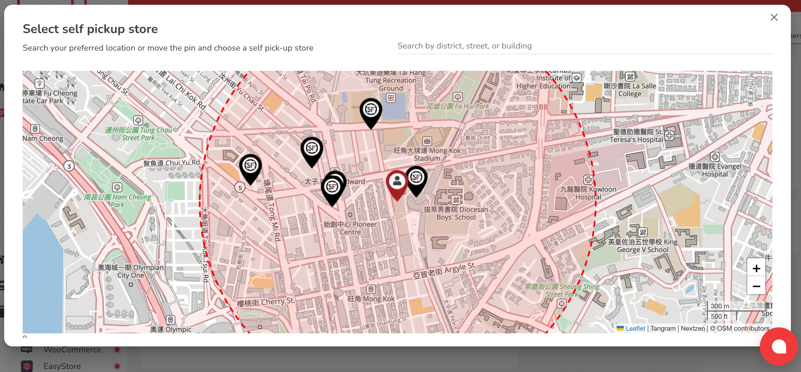

# 創建和安排 Pickupp Standard 翌日訂單(API/Non-API)

非API商戶下單方式

1. **登入平台**&#x20;
   * 登入Pickupp的商戶帳號介面
2. **選擇服務:**
   * 選擇建立翌日訂單

<figure><figcaption></figcaption></figure>

3. **填寫寄件者資料：**

* 完整填寫寄件人資訊，包括姓名、電話號碼（8位數字）和地址（包括地址號碼、名稱和建築物）。

4. **填寫寄件者資料：**

* 完成收件人資訊，並選擇「送貨上門」或「自取」服務。&#x20;
* 如果選擇自取，這意味著收件人/收貨人將前往指定的儲物櫃進行自取過程。點擊「自取服務站」鏈接以打開單獨的屏幕。請確保您選擇所需的自取店鋪編號。

<figure><figcaption></figcaption></figure>

5. **提供物品詳情**

* 在物品資訊中輸入包裹的準確尺寸，包括長度、寬度、高度和重量。

6. **選擇服務**

* 根據服務類型、時程和費用，選擇最適合您需求的服務。確認您的選擇後，繼續進行支付。

#### 非API對接商戶多單上傳

1. **登入平台**
   * 請登入Pickupp商家門戶並確保您正在使用「專業模式」，切換到左下角按鈕。
2. **批量上傳**
   * 與訂單欄目，點擊'批量上傳訂單'。
3. **使用範本:**
   * 下載「翌日送件訂單範本」新版本 v1.3 | 2023年11月9日並安照範本指示正確填寫每個欄目。
4. **上傳訂單信息:**
   * 請上傳已完成的範本。如果創建自取訂單，請務必在「自取服務點）」欄中包含SF順豐自取點的自取點編號。
5. &#x20;**填寫送件人資料:**
   * 填好送件人欄目包括名字及電話·。
6. &#x20;**填寫收件人資料:**
   * 填好收件人欄目包括名字及電話。另外選擇 「送貨上門」或「自取」。若選擇自取訂單，請務必在「自取服務點）」欄中包含SF順豐自取點的自取點編號。
7. **貨件資料：**
   * 在「貨件資料」部分準確填寫包裹的尺寸和重量。如默認小、中、大尺寸不合適，可以使用手動輸入。
8. **選擇服務:**
   * 右手邊選擇One Day翌日訂單，然後按下一步。
9. **完成上傳:**
   * 如一切正確且已確認，請選擇「上傳」，然後繼續確認和支付。

#### API對接商戶建立訂單

1. **系統確認:**
   * 確保系統設置與Pickupp一致，包括服務定價和運單waybill版本。
2. **API設置配置:**
   * 根據需要在商戶端調整API設置。
3. **Pickupp系統設置:**
   * 確認Pickupp系統內的設置。
4. **服務選擇:**
   * 根據API文檔提供的指示，選擇正確的Pickupp服務（Service Offering ID）。
5. **通過API創建訂單:**
   * 使用選定的Pickupp服務（Service Offering ID），根據API文檔中提供的截圖創建訂單。

#### 對於客製化運單（Unique Waybills）的商家

1. **啟用系統設置:**
   * 如果您打算使用自己的客戶參考號（CRN）和條碼的運單，請與Pickupp確認系統設置。
2. **自己的客戶參考號（CRN）要求:**
   * 確保客戶參考號（CRN）沒有在平台重複；系統將拒絕任何非唯一的CRN或已有CRN下的包裹。在創建訂單之前，請聯繫Pickupp以獲得系統設置協助。
