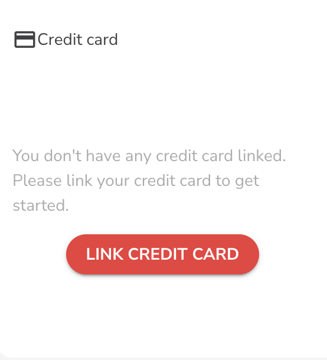

# 增值錢包或信用卡連結

點擊「付款」，「付款資訊」進入付款頁面。

<figure><figcaption></figcaption></figure>

## 電子錢包充值

1. 點擊 "增值".

<figure><figcaption></figcaption></figure>

2. 請選擇充值金額，系統將顯示可用的支付方式。

<figure><figcaption></figcaption></figure>

3. 選擇金額後，系統將顯示可用的支付方式，支持的支付方式包括支付寶、微信支付和信用卡連結。

<figure><figcaption></figcaption></figure>

4. 如果選擇支付寶或微信支付，系統將生成一個QR碼。您可以使用相應的支付應用程序掃描該QR碼並完成交易。

<figure><figcaption></figcaption></figure>

5. 支付成功後，充值金額將顯示在您的電子錢包餘額中。

## 連結信用卡

1. 點擊「連結信用卡」選項，系統將彈出一個用於連結信用卡的窗口。

<figure><figcaption></figcaption></figure>

2. 在提供的字段中輸入所需的信用卡資訊，包括卡號、到期日期和安全碼。

<figure><figcaption></figcaption></figure>

3. 完成輸入後，點擊確認，您的信用卡詳細資訊將成功連結到您的電子錢包帳戶。 一旦連結成功，您可以在充值頁面輕鬆選擇連結的信用卡進行快速充值，提供便捷的支付選項。

### 附加的銀行轉帳資訊

1. 如果您選擇銀行轉賬方式，請上傳成功轉賬的截圖、轉賬金額和轉賬日期。Pickupp團隊將在1個工作日內驗證轉賬資訊並將金額存入您的電子錢包。

<figure><figcaption></figcaption></figure>

2.  這樣的操作流程讓您能夠靈活地選擇充值金額和支付方式。此外，它為不同的支付方式提供了相應的QR碼或轉賬詳細資訊，確保支付過程的安全性和便捷性。對於銀行轉賬，附加的資訊確保了順暢的驗證過程和及時的充值金額入賬。

    Share

<figure><figcaption></figcaption></figure>

### 附加的銀行轉帳資訊

1. 如果您選擇銀行轉賬方式，請上傳成功轉賬的截圖、轉賬金額和轉賬日期。Pickupp團隊將在1個工作日內驗證轉賬資訊並將金額存入您的電子錢包。

<figure><figcaption></figcaption></figure>

2.  這樣的操作流程讓您能夠靈活地選擇充值金額和支付方式。此外，它為不同的支付方式提供了相應的QR碼或轉賬詳細資訊，確保支付過程的安全性和便捷性。對於銀行轉賬，附加的資訊確保了順暢的驗證過程和及時的充值金額入賬。

    Share
